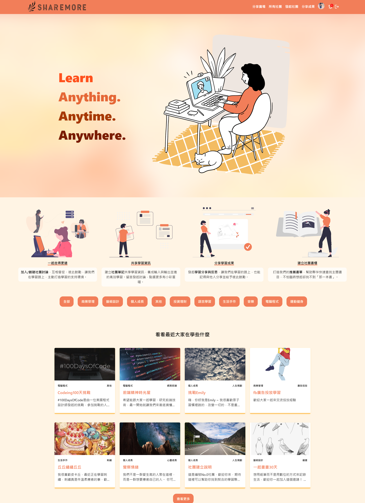

# shareMore

A social networking site that makes it easy for user to find mutual learning partners and share milestones with each other online.

- Applied `React` / `React Router` for `SPA` and `Redux` for global state management.
- Applied `styled-components` to write CSS in JS efficiently.
- Designed complex data structures for social network requests in proceeding CRUD operations.
- Implemented compressed image processing when uploading image with `compressor.js`
- Implement native / Facebook / Google login and register via `Firebase Authentication`.
- Integrated Google Books APIs for searching book and storing them in firestore.
- Implemented WYSIWYG text editor using `React Quill`.
- Supported RWD on mobile, tablet devices, to create excellent user experience.
- Provided an instant search feature via `Algolia`.

## Demo

- Link : [https://sharemore-discovermore.web.app/](https://sharemore-discovermore.web.app/)
- Test Account
  - User : test@test.com
  - Password : test12345

## Technologies

- Fundamental

  - HTML5 / CSS3 / JavaScript ES6
  - Responsive Web Design

- Frameworks

  - React
  - Hooks
  - React Router
  - Redux / React Redux
  - styled-components

- Firebase

  - Authentication
  - cloud Firestore
  - Storage
  - Hosting

- Pachages
  - react-quill
  - compressorjs
  - slick-carousel
  - react-select
  - react-html-parser
  - quill-image-resize-module-react

## Flow Chart

## Feature

- Create or Apply to join the learning group.  
  You can only view the introduction and recommended books of the group before you become a member.
  

- Implementation Review Mechanism.  
  The group director has the authority to review member applications.
  

- Join successfully, with permission to post message, co-edit book recommendations, create/read notes.
  

- Edit group content. The group director has the authority to edit group content and cover photo.
  

- Quick collection and editing of notes. The group director and author of the comment have the authority to import the whole discussion into the editing area to keep it in the note.
  

- Create a learning book list with members.Quickly search for books and fill in the reason for recommendation.
  

- Create learning milestones for participating groups with the WYSIWYG editor.
  

- Personal page shows joining/creating groups, publishing articles, and you can edit personal external links
  

- To like/comment/favorite the article and copy link to share quickly.
  

- Show notification when article got new comment.
  

## Future Features

- Add a Friend feature
- Video conferencing function
- Live chat room

## Contact

If you got any problem when using shareMore, or had any suggestion about it. Please feel free to contact with me via email.

- Author : Emily Chen
- Email : emilydondon@gmail.com
- Blog : https://emilywalkdone.blogspot.com/
